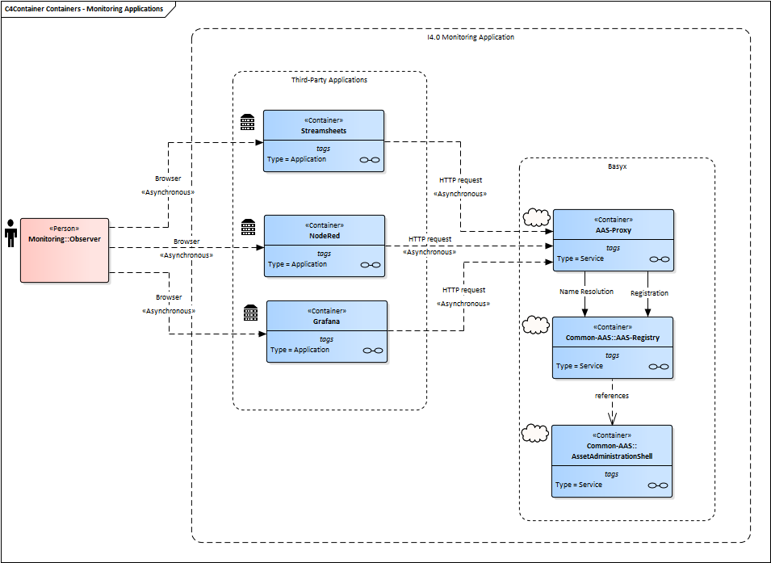
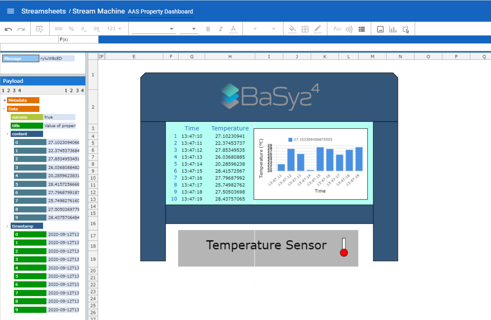
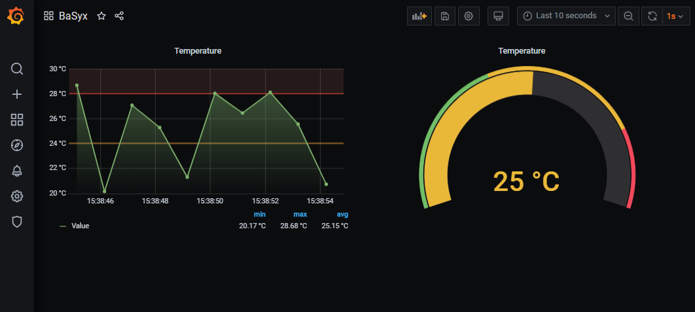
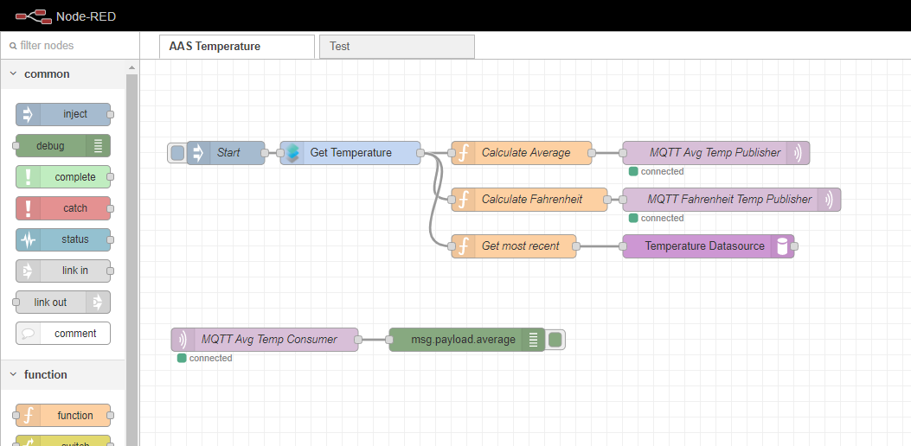

# Architecture Overview
Figure 1 illustrates the interface between ASS, Registry, Proxy and Grafana/Streamsheets/NodeRed-applications.

* Registry is responsible to locate and identify available AAS(s) in the network.
* Proxy is responsible to intermediate the communication and exchange data between AAS and third-party applications.
* AAS is responsible to provide the data.

For such scenario, we assume that the AAS sub-models provide the access of multiple sensor data, which change dynamically at runtime to reflect the current production status.



# How to Build
In addition to directly using the already provided docker images, it is also possible to build them by yourself using the BaSyx SDK and the supplementary projects in the GIT repository. For building the Java projects you will also need the Java Development Kit.

**Requirements**:

* Docker is installed and running. It has to be ensured that the docker daemon is exposed on tcp://localhost:2375 without TLS so that the docker image can be built during the build process.
* BaSyx SDK has been installed - see: https://wiki.eclipse.org/BaSyx_/_Download_/_Java_Setup
* BaSyx components (basyx.components.simple) have been installed - see: https://wiki.eclipse.org/BaSyx_/_Documentation_/_Components_/_Docker

**Installation**:

```
1. Clone BaSyx monitoring examples from the GIT repository
2. Browse to /examples
3. Run the build.bat for the aasWrapper and the dashboardAAS
4. Run the build.bat for the respective application scenario (NodeRED, Grafana or Streamsheets)
5. Finalize the setup using the instructions in the readme.txt in the respective folders.
```
Now the automatic build process will build the project binaries and docker images necessary to run the example in accordance to the previous section.

**Start the Monitoring Applications**:

```
1. Run start.bat
```
Automatically all docker containers will start, for this example in the following ports:

```
1. The AAS - http://localhost:6400/aas/
2. The Proxy - http://localhost:6500/proxyAAS/aas
3. The Registry - http://localhost:4000/registry/api/v1/registry/
4. Streamsheets - http://localhost:8081/
5. Grafana - http://localhost:3000/
6. Node-RED - http://localhost:1880/
```

**Stop the Monitoring Applications**:
```
1. Run stop.bat
```

# Applications Examples
## Streamsheets
[Streamsheets](https://cedalo.com) is an Eclipse project providing an application for monitoring and visualizing streams of data from various sources.

* With Streamsheets it is possible to process, aggregate, visualize and transform data streams in real-time as a server app.
* Streamsheets exchange data over REST-based protocols (request/response), and ts also designed for publish/subscribe streaming protocols like MQTT, Apache Kafka or AMQP.
* Streamsheets can also be customized its visual interface, buy adding images, colors, buttons.

### Stream Machine Example



### Setting Up a New Streamsheet
The configuration of the HTTP-connector and the producer follows the following steps:

```
 1. Start by creating the Connector in the Connector Dashboard in the Administration Menu. Go to the side pane and select the “Administration”.
 2. In the side pane of the “Administration”, select “Streams” -> “Connectors”.
 3. Select the “+”-symbol on the top right to add a new connector.
 4. Enter a name for the connector. The others can be left empty. You can leave all fields empty to be able to utilize this Connector for any URL. If you want to create specific Connectors for every webpage, type in the Base URL.
 5.  Go to Side-Pane -> “Streams” -> “Producers”. Click on the “+”-symbol on the top right to add a new producer. 
```

At run time, the data-points of the Streamsheets-application create HTTP-Requests with the producer periodically. The HTTP-connector communicates with the AAS based on these HTTP-requests. The responses are transmitted back to the Streamsheets-application. For the real time display, HTTP-GET requests are generated cyclically and the responses are updated to the data points in the Streamsheets-application. The configuration of the data points in the Streamsheets-application follow the following steps:

## Grafana
[Grafana](https://grafana.com) is an Open-Source application available on GitHub. It's a browser-based tool for creating dashboards of different types of data sources.

* Grafana has plenty of different panels and data sources available in the official repository.
* Grafana allows its users to query, visualize, and alert on metrics and logs independent of where data is stored.
* Grafana reads data of multiple sources and the user can visualize it in a single dashboard.

### Grafana Dashboard Example



### Setting up a new panel

There are two possibilities for panels that can make use of the proxy:

* Use datasource plugin that comes with the example
* Use Ajax plugin => can already query any kind of JSON datasource

## Node Red

[Node-RED](https://nodered.org) is under OpenJS Foundation. It is a browser-based tool for flow editing.

* Node-RED allow users to create flows composed by nodes and links. These flows can be wired, and then deployed in runtime.
* Node-RED focus is "low-programming" of applications that run in event-driven basis.
* Flows can be deployed to run locally; in a device (e.g. a Raspberry Pi); or in the cloud.
* Nodes can be customized via scripting according to needs. They may send and receive messages whilst the flow is running.

### Node-RED Dashboard Example



### Setting up a new panel
* To create a new node, see detailed documentation [here](https://nodered.org/docs/creating-nodes/). Basically 3 files have to be created.
```
 1. package.json: which is used to pack it all together and compile it using npm.
 2. <your-example-node>.js : which contains the function which shall be executed when the node is running. 
 3. <your-example-node>.html : which provides the main node to be registered in the editor, the edit template, and the auxiliary text to exibit in the node.
```
* To see the current customization of our example:
```
 1. Open the folder docker/node-red/node-red-contrib-aas-connect/
 2. The business logic is define under the .js files. E.g.: open the file get-aas-property.js
   2.1. This node is created to read the var temp from the ProxyAAS.
```