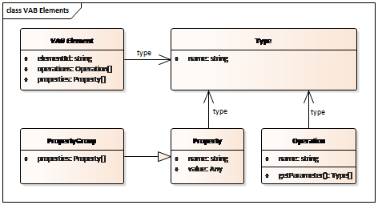
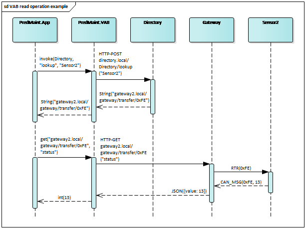
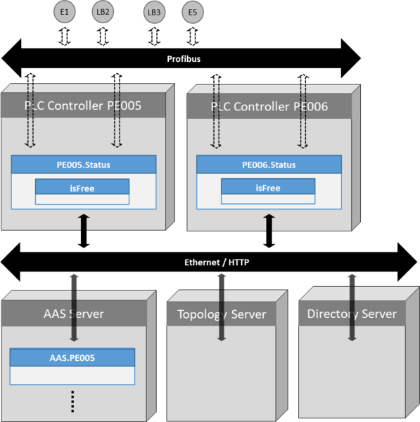
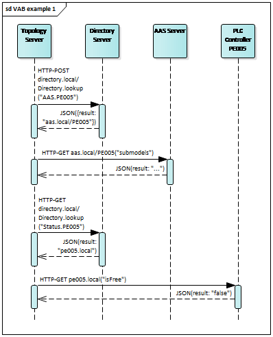
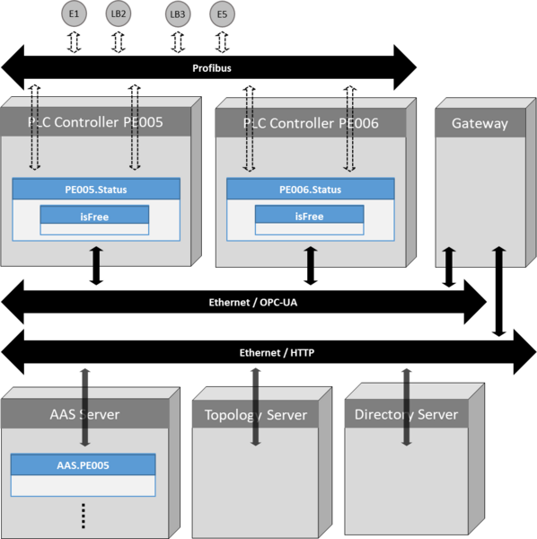
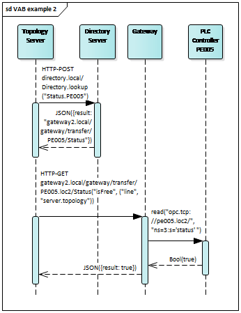

# Virtual Automation Bus
The virtual automation bus (VAB) is our implementation of an end-to-end communication for Industrie 4.0. It maps one communication semantic with five primitives to different networks and protocols. This way, the VAB can bridge networks via gateways, and can also integrate legacy devices into the virtual end-to-end communication network. The VAB supports different kinds of connected entities and hides the distributed deployment of them. All entities are represented by properties and operations with defined types that may be accessed by other entities.

Each protocol may be mapped to the VAB by creating a mapping of this five primitives to its native communication techniques. As an example, in the world of HTTP the delete primitive may be mapped to a HTTP-Delete request. Communication between networks using different protocols is supported by gateways translating between the protocols.

The benefit of this approach is a reduced implementation effort to bridge different communication technologies. Instead of having to translate from every protocol to every protocol (NxM) it is possible to use the VAB primitives as intermediate and reduce the complexity (N+M).


```{toctree}
:hidden:
:maxdepth: 1

http_rest_mapping
tcp_mapping
json_serialization
exceptions
```


## Virtual Automation Bus concept
The figure below illustrates an example virtual automation bus with connected entities.


* Controller runtime environments (Controller RTE) are real-time runtime environments (RTE) that are specifically designed for control automation. A prominent example for Controller RTE are PLC controllers. Controller RTE implement for example device controllers that provide service-based access to controlled devices. In the shown example, these are engine actuators (E1 and E5), as well as light barriers (LB2 and LB3). These services are often low-level services like basic transportation services. Group controllers may be implemented on Controller RTE as well. They provide higher-level services that aggregate low-level services from device controllers. Controller runtime environments support both service based communication and signal-based interaction that enables pure data exchange via input and output ports.
* Application runtime environments (Application RTE) execute high-level applications that interact with the office-floor. They may also implement group components, which realize high-level services based on services from other group- or device components. Application RTEs host applications that offer service calls and use service calls to interact with other functions. They require access to the VAB to communicate with shop floor devices.
* The discovery service is a unified way for components to connect with VAB entities and to discover Asset Administration Shells. The directory service resolves virtual AAS identifiers, e.g. URIs, to network addresses. Network addresses are specific to one communication system. The same deployment therefore may consist of several directory services that serve automation components connected to different communication networks.
* VAB elements provide a unified interface to access entities that are connected to the VAB. They support read/write access to values and implement callable operation, as well as optional dynamic creation and deleting of properties. * VAB Communication implements data and message transport services to connect automation components as VAB entities. The VAB map a specific communication technology to the BaSys communication semantics and operations to enable inter-network end-to-end communication. It hides nature and deployment location of VAB entities behind regular interfaces.

## Virtual Automation Bus type system
We have based the VAB on a technology independent type system to enable seamless end-to-end communication between device types. Technology mappings realize these technology independent types with platform types. Platform types must at least support the value ranges and accuracy of the defined technology independent types. The following table defines technology independent types for the VAB.

|         Type        |                                                                Description                                                                |
|:-------------------:|:-----------------------------------------------------------------------------------------------------------------------------------------:|
| String              | Represents a string of arbitrary length                                                                                                   |
| Boolean             | Represents a boolean value, i.e. true or false                                                                                            |
| Double              | Represents a floating point value with value range and accurary as described in IEEE 754-1985                                             |
| Integer             | Represents a 32 bit signed integer value with value range [-2^31, (2^31) - 1].                                                            |
| Map<String, Object> | Represents a map object using a string as key, mapping to arbitrary objects of this table. Nested maps of arbitrary depths are supported. |
| List<Object>        | Represents an ordered list of arbitrary objects of this table. Nested lists of arbitrary depths are supported.                            |

## Technology independent VAB element interface
VAB elements need to implement a unified interface that consists of five primitives for interaction with VAB elements. These primitives define expected technology independent semantics for the VAB. Every VAB implementation and gateway needs to map these five primitives to network specific telegrams:

* ``Ref create(elementId, par[name], par[value])``
Create a new property in an VAB element with parent element elementId. The name of the new property is defined by parameter name (par[name]), and is assigned the value defined by parameter value (par[value]). This operation returns a unique reference (Ref) to the created element.
* ``Ref delete(elementId, par[name])``
Delete a property of an VAB element identified by name par[name] from element identified by elementId.
* ``Any retrieve(elementId, par[name])``
Return value of property par[name] of VAB element elementId.
* ``void update(elementId, par[name], par[value])``
Change value of property par[name] of VAB element elementId to new value par[value].
* ``Any invoke(elementId, par[name], par[parameter])``
Invokes operation par[name] of VAB element with ID elementId with parameter array par[parameter]. The result will be returned when service execution is completed.

The retrieve VAB primitive has no side effects, and therefore may be safely repeated several times. All other primitives have potential side effects that affect permanently the status of VAB elements. In case of communication errors, the VAB implementation therefore needs to ensure that an primitive with possible side effects is not automatically re-executed. Instead, the VAB indicates the communication failure to the communication initiator.

## Technology mapping
Currently, there are two mappings defined by BaSyx: [TCP](../vab/tcp_mapping.md) and [HTTP/REST](../vab/http_rest_mapping.md) both using a custom [JSON serialization](../vab/json_serialization.md). Additionally, an OPC UA mapping is in work.

## VAB elements

Our Industrie 4.0 VAB structures information in VAB elements. VAB elements contain a list of properties and operations. Both lists are properties of the VAB element and may be accessed alike any other VAB element property with the *create/update/retrieve/delete* primitives described above. Operations support the invoke operation. We define property groups that contain nested properties to support the hierarchical grouping of properties. Complex VAB objects are realized by specializing VAB elements. For example, to implement an Asset Administration Shell concept, we define Asset Administration Shell objects (AAS) and Sub Models (SM) as specialized VAB elements with predefined additional properties.




VAB Elements have unique identifiers (*elementId*), which are e.g. URIs that identify elements independently from the network that it is located in. Mapping between logic URIs and network addresses (URL, IP-Address, OPC-UA name) is via a directory service that resolves logic addresses to physical, network specific addresses. The illustrated example network topology for VAB communication illustrates a network topology with Ethernet, Profibus, and CAN networks. Communication is between a predictive maintenance server (*PredMaint*), which is attached to the Ethernet network, and *Sensor2* that connects to a CAN bus.


The communication sequence below illustrates the execution of the VAB retrieve operation. *PredMaint* first retrieves the network address of *Sensor2* from its local directory service by invoking the lookup operation that subsequently queries other directory services if necessary. The address points to the URL of a gateway that connects the Ethernet network to the CAN bus. Afterwards, application *PredMaint.App* invokes VAB *retrieve* operation. The VAB network driver translates this into a HTTP *get* request. The gateway is responsible for forwarding this request within the next network. The application *PredMaint* then queries value *status* from *Sensor2*. Since CAN implements multicast communication based on message IDs, the gateway looks up the message ID that corresponds to the requested element (*Sensor2*) and property path (*status*), and transmits a remote transmit request (RTR) frame with ID *0xF*E that triggers transmission of the most recent data value from the provider node, which is *Sensor2*. The gateway then passes the received CAN value back to the caller.





Communication between the application layer predictive maintenance application *PredMaint.App* and network layer PredMaint.VAB in the communication sequence above illustrates the mapping of VAB calls to network specific operations. Depending on the network type, this mapping may yield a single network operation, or, as shown in the example, a sequence of network operations. In case of VAB operations that need to pass multiple gateways, each gateway is responsible for forwarding this request to its connected network. A gateway uses its local directory service to determine the best route within one network to the destination address. As illustrated below, the destination in the local network may be another gateway or the target node.


# Virtual Automation Bus Examples
In this section, we document example mappings of the VAB to illustrate its realization.


## HTTP-REST deployment
In our first example, field devices connect via a Profibus Fieldbus network to controllers; all other devices connect to the same Ethernet network. Asset Administration Shells of controllers and the plant reside on an AAS server, servers and PLC controllers provide AAS sub model data. The VAB is realized with HTTP communication. The mapping of the primitives to HTTP/REST is described [here](../vab/http_rest_mapping.md)





The sequence diagram below illustrates an example interaction between the topology server and controller *PE005*. Controller *PE005* controls a segment of a transport rail. The topology server exports a topology sub model that contains the property *isFree* for each transport rail segment of the plant, which indicates if a product is on the segment or not. A PLC controller calculates this property value for example based on light barriers that monitor the segment. The topology server periodically queries the *isFree* property of all segments to provide a condensed view to operators.

In the illustrated example sequence, the topology server queries the value of *isFree* from the Asset Administration Shell (AAS) of segment *PE005*. In the first step, the topology server performs a lookup of the AAS with ID *AAS.PE005* using a HTTP-POST directive to invoke the lookup operation on its known directory server instance. The directory returns a URL with the local top-level domain *.local* that points to the AAS provider for *PE005*, which is a server in office floor. The topology server then reads the available sub models of the AAS of controller *PE005* using the VAB retrieve operation. The VAB HTTP network driver maps this retrieve to a HTTP GET request. Then the topology server invokes the directory server again to query the address of the sub model provider for sub model Status.PE005, which contains the isFree property. This is the PLC controller *PE005* that exports the isFree property. The topology server then uses the VAB to access the PLC controller *PE005* to read the value using the retrieve VAB operation.





As indicated above, the HTTP REST network mapping uses element ID e and property name *n*, or property path *p* to create the URL as target for HTTP operations. Parameter are encoded using JSON encoding and transmitted in the HTTP request body. Return values are encoded using JSON as well.

## Multi network scenario

This second example describes a situation with two different Ethernet networks. Shop floor devices communicate via OPC-UA. Enterprise components in the office floor communicate via HTTP/REST web services. Similar to the first deployment, Asset Administration Shells represent all production entities, and sub models are distributed in the networks. In contrast to the first deployment, the virtual automation bus needs to bridge different networks. The gateway operates on protocol level and translates VAB operations between both networks.





The sequence diagram below illustrates the resulting call sequence. The Topology server first asks its local directory server for the sub model Status of AAS *AAS.PE005 (Status.PE005)*. It receives a reference as response that points to the gateway and encodes the OPC-UA address of the controller in the other network (*pe005.loc2*). The topology server invokes the HTTP GET command via the received URL in the same way as in the first scenario. The presence of the gateway is transparent for the topology server. The Gateway processes the GET command, transforms the requested property address in the *dest* field to the appropriate OPC-UA call, and invokes the OPC-UA *ReadValue* operation that reads the value of property *isFree*. When the gateway then invokes the OPC-UA *ReadValue* operation, the gateway has to add the namespace ID (3 in the example), which therefore needs to be known for this gateway. The value therefore either needs to be pre-configured, or it needs to use another directory server.





