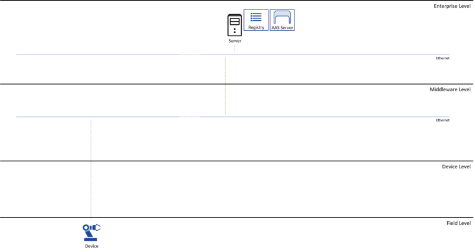

# Step 2: Setting up the Eclipse BaSyx infrastructure
This step consists of the setting up of the initial Eclipse BaSyx infrastructure, which is illustrated below. It consists of two mandatory containers – an AAS server and an AAS registry component. Both containers will be deployed on a server. This example will use the pre-configured components from dockerhub, which keep all data in memory. Therefore, all changes will be lost when the servers are stopped. To prevent this a different backend must be configured that stores data for example in a database. The necessary steps for this are documented here ([BaSyx AAS Server Component](../../user_documentation/basyx_components/aas-server/index.md)) and here ([BaSyx Registry Component](../../user_documentation/basyx_components/registry/index.md)).




## Setting up of the registry component
The Registry is a central component to the Asset Administration Shell (AAS) infrastructure for looking up available AAS and their contained Submodels. Hence, it is realized as a separate component that can also be containerized. Currently, there exists a single Registry component that can be configured to utilize different types of backends.

The registry image is made available via [Docker Hub](https://login.docker.com/u/login/identifier?state=hKFo2SA0QnhEQm9vUUFVRGZudE83eDJ3dHBPaXdDalZxYzFSMqFur3VuaXZlcnNhbC1sb2dpbqN0aWTZIGllalRURjdaQmEwY0JPdDBrSXdPU2ZtaDY1MUJEd2ZFo2NpZNkgbHZlOUdHbDhKdFNVcm5lUTFFVnVDMGxiakhkaTluYjk) and can be pulled by:
```
docker pull eclipsebasyx/aas-registry:1.2.0
```
To easily start the registry component, you can use the following command:
```
docker run -e basyxcontext_accesscontrolalloworigin="*" --name=registry -p 8082:4000 eclipsebasyx/aas-registry:1.2.0
```
In order to access our server from different sources ( Origins ) e.g. via the aas-gui, which we will set up in step 5, we need to set the respective CORS Header. We have done this by the setting:
```
basyxcontext_accesscontrolalloworigin="*"
```
For a more detailed explanation see [here](../../user_documentation/basyx_components/index.md)

Now the endpoint for registering and looking up AAS will be:
```
http://localhost:8082/registry/api/v1/registry
```
And the container can be stopped, started and removed using its name (see --name):
```
docker stop registry
docker start registry
docker rm registry
```
## Setting up of the AAS server component
The AAS server component provides an empty AAS server that can be used to host several AAS and Submodels. For its API see [Aggregator API](../../user_documentation/API/aas.md). Additionally, there's a video illustrating the configuration and usage in 5 minutes: [YouTube](https://www.youtube.com/watch?v=nGRNg0sj1oY). The AAS Server image is made available via [Docker Hub](https://hub.docker.com/r/eclipsebasyx/aas-server) and can be pulled by:
```
docker pull eclipsebasyx/aas-server:1.2.0
```
To easily start the AAS server component, you can use the following command:
```
docker run -e basyxcontext_accesscontrolalloworigin="*" --name=aas -p 8081:4001 eclipsebasyx/aas-server:1.2.0
```
Now the endpoint for accessing the server with its AAS is
```
http://localhost:8081/aasServer/shells/
```
And the container can be stopped, started and removed using its name (see --name):
```
docker stop aas
docker start aas
docker rm aas
```
Whoohoo! You have setup a working BaSyx infrastructure. Now, in the next steps, we are going to populate it.