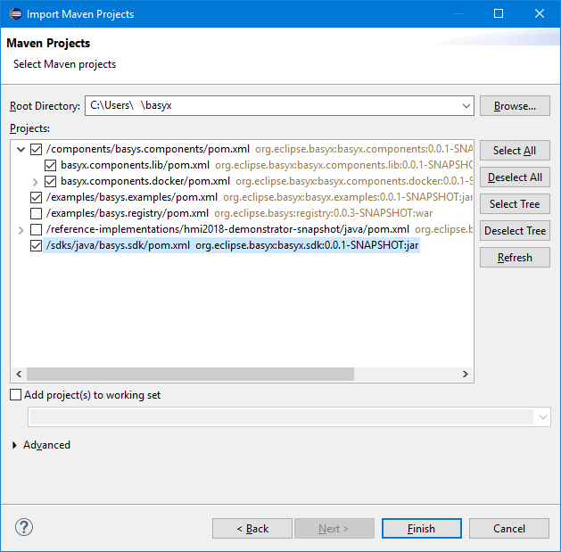
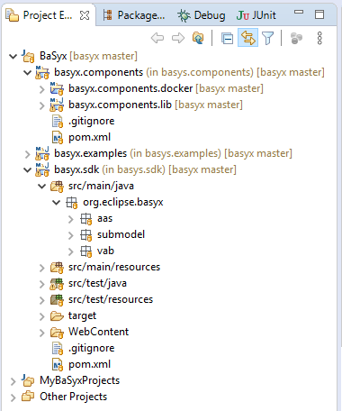

# Java Setup {How to build the BaSyx Java SDK}

<span style="color:red">!! Building BaSyx Java is only necessary if you would like to access the currently being developed features. All releases are available on [Maven Central](https://central.sonatype.com/search?q=org.eclipse.basyx&smo=true) and thus don't need to be build locally !!</span>
The complete installation process of the SDK and components is documented in a 15 minutes video: [YouTube](https://www.youtube.com/results?search_query=basyx)

The BaSyx Java SDK is using Maven to generate and control its building process.

This article will detail on how to set up the Java SDK from a new checkout.

## Requirements
The BaSyx Java SDK requires the following dependencies to successfully build:

* Java™ SE Development Kit 11
* Maven
To check out BaSyx, you also need a GIT installation. No Eclipse GIT plugin is required as we can do the checkout by using GIT only from the command line. If you want to checkout using Eclipse, you need the EGit plugin and also the Maven SCM Handler for EGit (more on that below).

## Getting started
1. Check out BaSyx from the command line with "git clone https://github.com/eclipse-basyx/basyx-java-sdk.git" for SDK, "git clone https://github.com/eclipse-basyx/basyx-java-components.git" for Components and "git clone https://github.com/eclipse-basyx/basyx-java-examples.git" for examples.
2. Start Eclipse and import the projects as maven projects (File -> Import -> Maven -> Existing Maven Projects -> Browse to the BaSyx directory)
3. Select (at least) the following Projects and click "Finish":



The Maven projects should be automatically set up in Eclipse. You can always update the project settings using the Maven plugin (Right Click -> Maven -> Update Project).

### Project dependencies
All dependencies for maven projects are specified in the project's pom.xml. When building the project using maven, these dependencies will be automatically taken from the local maven repository (default: *C:/User/username/.m2/repository*) and downloaded from the remote repository if it is not available locally.

The imported projects (sdk, components and examples) depend on each other as shown below:


This means **basyx.components** depends on **basyx.sdk** and **basyx.examples** depends on the two other projects. So if you make changes in e.g. basyx.sdk, you need to "install" it to the local repository using Maven before building components that depend on it.

### Project installation
1. Make sure that each project has a JDK selected as JRE System Library
    1. Window -> Preferences -> Java -> Installed JREs -> Enable the **JDK**
    2. -> Execution Environments -> JavaSE-11 -> Enable the JDK in the list of compatible JREs
2. Install **basyx.sdk**
    1. Right click -> Run As -> Maven install
    2. Maven will download all required dependencies, run the tests and build and install the project into the local Maven repository
    3. You can ignore errors in the output coming from testing exceptions in unit tests
    4. If successful, you will see the message: *[INFO] BUILD SUCCESS*
3. Prepare the components as described in [Setting up the Components project](components_setup.md)
4. Install **basyx.components** and **basyx.examples**
5. Done
After installation build outputs are placed in the /target folder and installed in the local Maven repository.

### Eclipse IDE configuration
Although the Eclipse IDE can handle the BaSyx projects, there are multiple settings that will make it easier to work with them. This is especially true, if you are working on hierarchical Maven projects as with basyx.components.

* Enable a **hierarchical Maven projects** representation
    * Window -> Show View -> Project Explorer
    * Project Explorer View Menu (three dots in the top right corner of the view) -> Projects Presentation -> Hierarchical
* Enable a **hierarchical packages** representation
    * Project/Package Explorer View Menu -> Package Presentation -> Hierarchical
* Make use of **working sets** to organize multiple groups of projects
    * Project/Package Explorer View Menu -> Top Level Elements -> Working Sets
    * Project Explorer View Menu -> Select Working Set -> New...
    * Add a Java working set named e.g. "BaSyx" and add all basyx.* projects to it
    * Add another Java working set for e.g. your own projects
* Prepare useful **launch configurations**
    * Right Click basyx.sdk project -> Run As -> Maven build..
    * Rename the launch configuration to e.g. "Install BaSyx SDK"
    * Enter "clean install" in "Goals:"
    * Click Apply and close the window
    * Repeat this for other run configurations (e.g. install components/examples...)
    * Click at the small, black down-arrow right next to the "Run As..."-icon (the white arrow in a green circle) in the toolbar
    * Organize Favorites... -> Add... -> Check "Install BaSyx SDK"
    * Click at the arrow next to the "Run As..."-icon again
    * Run your favorite launch configuration
* Customize **resource filters** if necessary (if you would like to see e.g. .gitignore or .env files)
    * Project Explorer Filters & Customization (filter symbol in the top right corner of the view)
    * Uncheck .* *resources*  in the list of Pre-set filters to be able to see .* files
    * Add own filters to hide specific files or folders again (e.g. .project, .classpath and .settings)

Final result:



### Further steps
The **[introductory examples](../../developer/java/knowledge_base/introductory_examples/index.md)** are a good starting point to see how the SDK itself can be utilized.

Furthermore, the **basyx.components** project is built on top of the **basyx.sdk** and provides additional components. Among others you will also find components with [predefined docker images](../../basyx_components/v1/index.md) inside.

There are extended [basyx.examples](../../developer/java/knowledge_base/examples/index.md) that demonstrate various examples and use cases for both projects.

Also read the article about [how to contribute](../../developer/contributing.md) to the open source code.

## Troubleshooting

### No compiler is provided
**Error**: When doing maven install, maven complains that no compiler could be found.
```
[ERROR] Failed to execute goal org.apache.maven.plugins:maven-compiler-plugin:3.8.1:compile (default-compile) on project basyx.sdk: Compilation failure
[ERROR] No compiler is provided in this environment. Perhaps you are running on a JRE rather than a JDK?
[ERROR] -> [Help 1]
```
**Solution**: This error is typically when maven is not able to find the installed JDK. To fix this for the Eclipse IDE, perform the following steps to add the installed JDK:

* Navigate to Window -> Preferences -> Java -> Installed JREs
* Add the JDK, if it is not already there. This can be done by the *Add*... button, selecting standard vm and selecting the JRE home to be the JDK folder
* Select the JDK as default be ensuring that the box next to it is checked
* Now, for each project the default JRE needs to be changed. This can be done by righ-clicking each project -> Preferences -> Java Build Path -> double *click JRE System* Library -> Select *Workspace default JRE (jdk....)*

If you are using maven from command line, this error can be fixed by ensuring that the JDK is added to the environment (e.g. PATH value on Windows).

### HTTP tests failing
**Error**: Tests related to HTTP are failing. The console contains an error similar to
```
SEVERE: Failed to initialize connector [Connector[HTTP/1.1-4001]]
... 
Caused by: java.net.BindException: Address already in use: bind
...
```

**Solution**: The reason for this error is that the port used by the HTTP tomcat server is already blocked. A common reason for this an already running tomcat instance. If you are using for example XMPP, it may occupy this port.

To fix this error, please close the application occupying the port.

### Cannot find '[..]junit[..]' on project build path
**Error**: Can't execute the JUnit tests in Eclipse IDE due to missing entries in the build path
```
Cannot find 'org.junit.platform.commons.annotation.Testable' on project build path.
JUnit 5 tests can only be run if JUnit 5 is on the build path.
```
**Solution**: Eclipse tries to run the test with JUnit 5, but the BaSyx project uses JUnit 4.

* Right click the test you want to run 🡒 Run As 🡒 Run Configurations...
* Select JUnit 4 as Test runner
* Click Run

### Eclipse shows errors in a project referencing the SDK
**Error**: If the basyx.sdk project is open in Eclipse, it might happen that Eclipse shows errors in a project referencing the basyx.sdk.

**Solution**: This problem can be solved by closing the basyx.sdk project:

* Right click basyx.sdk project 🡒 *Close Project*

### Ressource files cannot be loaded when executing .jar files exported in Eclipse
**Error**: Executing the exported .jar file leads to a java.lang.NullPointerException when loading e.g. a default *.properties file.

**Solution**: The project ressource files are not added to the classpath. There are two possible solutions to this problem:

1. Manual workaround, see [[Bug report](https://bugs.eclipse.org/bugs/show_bug.cgi?id=494937)]

* Right click on the project 🡒 Properties 🡒 Java Build Path
* On "Source" tab, remove "src/main/resources" from "Source folders on build path"
* Add it again

2. Build .jar using Maven

For Off-the-shelf components, an executable .jar is automatically built when creating a docker image:
```
mvn clean install -U -Pdocker -DskipTests
```
The .jar can be found in the /target directory with its dependencies located at /target/lib.

For new projects, the project's pom.xml has to be modified to support building executable jars. The pom.xml in the Off-the-shelf components can help with finding a correct configuration (see <pluginManagement> in basyx.components/basyx.components.docker/pom.xml).


## How to set up HTTPS communication
Please see [Security](../../basyx_components/v1/general_configuration/security/index.md) page for details.